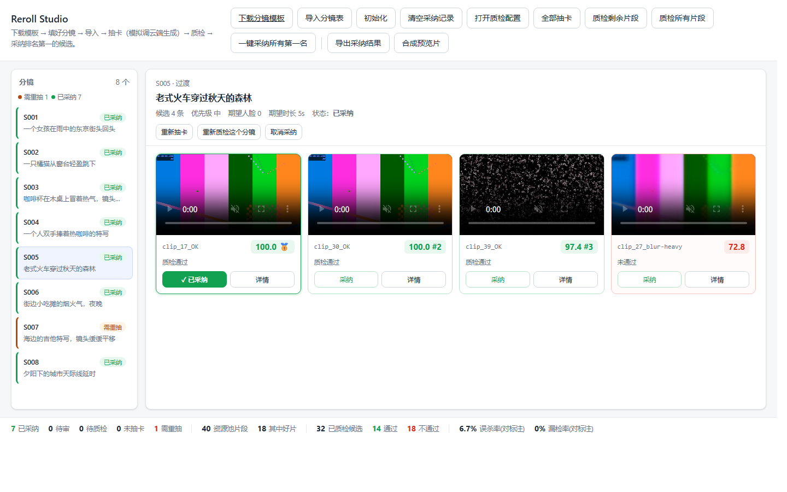
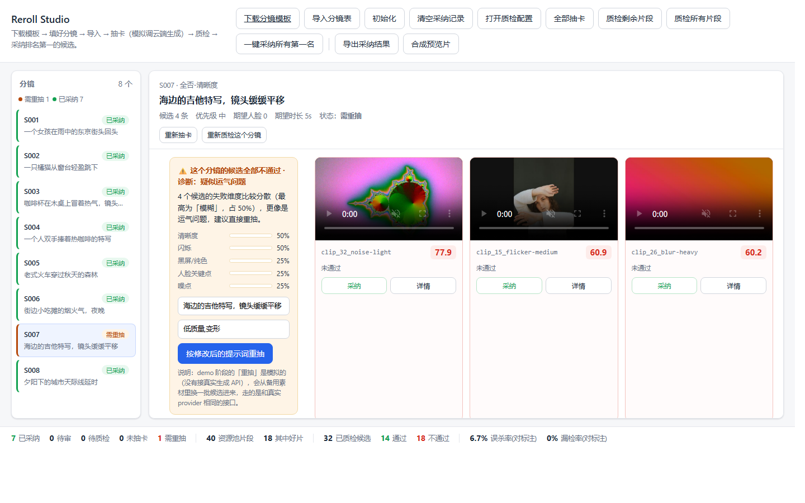

# Reroll Studio · AI 视频审片工作台（Demo）

把「人肉抽卡 + 人眼质检」变成「自动质检打分 → 通过的按分数排名 → 人工一键采纳 → 导出交付」。



> 状态机、可插拔的 8 个检测项、通过判定与排名、诊断重抽、交付导出——一条完整的链路。
> 目前用**本地视频资源池**模拟云端生成 API，换成真 provider 时编排与判定逻辑一行都不用改。

---

## 一句话说明它能干什么

完整流程就是真实生产流程的简化版：

```
下载分镜模板 → 填好 → 导入分镜表
      ↓
点「抽卡」→ 从视频资源池随机取片段，作为该分镜的候选
            （真实场景下这一步是调用云端生成 API）
      ↓
手动触发质检 → 系统按你勾选的检测项逐条打分
      ↓
硬性项不过直接判废；软性项按权重扣分，总分低于线判废
      ↓
通过的候选按分数排名 → 你只需复核并采纳（或一键采纳所有第一名）
      ↓
全部不通过时，系统会诊断"是运气差还是提示词缺了约束"并给出修改建议
      ↓
全部采纳完 → 导出成统一规格的片段 + 清单，并拼一条预览片整体看一遍
```

---

## 怎么启动

**双击 `start.bat`**。

第一次启动会自动做三件事（约 2–4 分钟）：
1. 在工作区内准备 Python 环境（不会动你的系统）
2. 生成 40 个合成测试视频
3. 启动服务并自动打开浏览器

之后每次双击，几秒就起来了。**关闭那个黑窗口就是停止服务。**

> 环境完全落在本目录内（`.python/`、`.venv/`、`.uv-cache/`），不污染系统。
> 想彻底删除，直接把整个文件夹删掉即可。

> **重启不丢工作**：导入的分镜表和抽到的候选会落到 `state/project.json`，
> 采纳记录和质检配置在 `state/session.json`。重启后候选原样回来（质检结果需要
> 重跑一次，因为它是派生数据）。删掉这两个文件就等于恢复出厂设置。

---

## 界面怎么用

界面分两块：**左边分镜列表 · 右边候选视频**。质检配置在弹窗里。

右上角按钮分三类：

- **入口**：下载分镜模板 / 导入分镜表
- **项目**：初始化（清空一切，从头开始）· 清空采纳记录
- **干活**：打开质检配置 · 全部抽卡 · 质检剩余片段 · 质检所有片段 · 一键采纳所有第一名
- **交付**：导出采纳结果 · 合成预览片

> **「初始化」** 会先弹窗确认，然后清空分镜、候选、质检结果和采纳记录，
> 质检配置也恢复默认；视频资源池不受影响。清空后工作台是空的，
> 需要重新导入分镜表（可以先用「下载分镜模板」拿到内置示例）。

### 分镜的 5 种状态

每个分镜在左侧列表里都有明确的状态标记，左边还有状态图例和数量统计：

| 状态 | 含义 |
|---|---|
| **未生成** | 还没有候选视频 |
| **待质检** | 有候选，但还没跑过质检（或候选刚被重抽过） |
| **待审** | 质检完成，有通过的候选，等你采纳 |
| **需重抽** | 质检完成，但没有一条通过 |
| **已采纳** | 已经选定了某一条 |

状态由后端 `app/runtime.py` **统一判定**，前端只负责显示。
判定优先级：**未生成 > 待质检 > 需重抽 > 已采纳 > 待审**。

质检结果和两个"指纹"绑定：**候选集合**和**质检配置**。
其中任意一个变了，旧结果立刻失效，分镜自动回到「待质检」：

- 重抽导致候选变了
- 改勾选、改阈值、改权重、拖动顺序
- 改总分线或容忍度

（改配置后是**立刻**生效的——界面每次改动都会同步给服务端，
不需要先点一次质检。已采纳的记录不会被清掉，只是提示你需要重新质检。）

### 第 1 步：下载模板 → 导入分镜表

点右上角 **「下载分镜模板」** 拿到 `分镜表模板.xlsx`（Excel，内置的 8 个示例分镜已经填好，
包括优先级、候选数和备注）。在 Excel 里改完之后点 **「导入分镜表」** 上传。

模板本身是"能看"的：中文表头 + 冻结窗格 + 下拉选项（优先级/画幅/候选数）+ 单元格批注
（鼠标悬停在表头上就能看到这一列该怎么填）。

**支持的格式**：`.xlsx` / `.xlsm` / `.csv`

- 表头**中英文都认**（`提示词`、`prompt`、`PROMPT` 都行），全角括号、空格、下划线都不敏感
- 空白行会被自动跳过
- **Excel 只读第一个工作表**，其它工作表忽略（会在提示里告诉你是哪个表）
- **提示词**是**必填**列，其余可留空
- 认不出来的列会被忽略，并在提示里列出来

列定义：

| 列（中文） | 英文别名 | 说明 |
|---|---|---|
| 分镜号 | `shot_id` | 分镜编号，留空会自动生成 |
| 场景 | `scene` | 场次备注 |
| **提示词** | `prompt` | **必填**，分镜提示词 |
| 负面词 | `negative_prompt` | 负面词 |
| 时长(秒) | `duration_s` | 期望时长（秒） |
| 画幅 | `aspect_ratio` | 宽高比，如 `16:9` |
| 候选数 | `candidates_per_shot` | **这个分镜抽卡时抽几条候选**，默认 4 |
| 参考图 | `ref_image` | 参考图路径（图生视频用） |
| 期望人脸数 | `expected_faces` | 期望人脸数（质检用） |
| 期望手部数 | `expected_hands` | 期望手部数（质检用） |
| 优先级 | `priority` | 高 / 中 / 低 |
| 备注 | `notes` | 备注（只给人看，不参与质检） |

> 想要 CSV 版本的话，把下载链接换成 `/api/template?fmt=csv` 即可
> （UTF-8 BOM 编码，Excel 打开中文不乱码）。

### 第 2 步：抽卡（模拟调用云端生成）

每个分镜初始都是「未抽卡」状态。

- 分镜标题下的 **「抽卡」** —— 从视频资源池随机取候选片段
- 右上角 **「全部抽卡」** —— 给所有还没抽过卡的分镜都抽一遍
- 已有候选的分镜想换一批，点分镜下的 **「重新抽卡」**

> **抽卡前会先弹窗**，把这一镜的提示词、负面词、候选数、时长、画幅、期望人脸/手部数
> 都摆出来，**可以直接改，改完再抽**——真实场景下这就是"调整提示词重新生成"。
> 「全部抽卡」是批量动作，只弹一次确认框，不逐个改提示词。

> **抽几条是分镜表里配的**：模板里的「候选数」列，逐镜可调（1-12），没填就是默认 4 条。
> 这模拟了"每条镜头按预算决定生成几条"——重要镜头多抽几条，次要镜头少抽。

> **什么是资源池**：`data/pool/` 下平铺着 40 个视频片段，抽卡时随机取。
> 这模拟了"调用云端生成 API，每次拿回来的片子不一样"。
> **池子里每个片段的文件名直接标了它的状态**，比如
> `clip_03_blur-medium.mp4`（模糊·中）、`clip_33_flicker-heavy.mp4`（闪烁·重）、
> `clip_17_OK.mp4`（好片）。所以抽完你就能知道"这次抽到的是好片还是废片"，
> 用来核对质检判得对不对。候选卡片上显示的 id 就是文件名去掉扩展名。

### 第 3 步：配置质检项

点右上角 **「打开质检配置」**，在弹出的窗口里：

- **勾选**要跑哪些检测项
- **拖动**调整执行顺序
- 每项可以调 **阈值** 和 **权重**
- **总分线** 决定"总分低于多少判废"，**容忍度** 决定"软性项失败多少就判废"

改完点 **「保存」** 才统一生效——改动在保存前只存在草稿里，
点「取消」、按 ESC、或点遮罩都会丢弃。

**保存后**：服务端记下新配置，凡是拿旧配置跑出来的结果立即失效，
相关分镜在左侧变回「待质检」，中间主界面也一并还原成"还没质检"。
已采纳的记录不会被清掉，只是提示你需要重新质检。

> 如果一个检测项都没勾选，质检按钮会置灰并提示原因——不会"偷偷把所有检测项都跑一遍"。
> 直接调 API 触发也会被拒绝（返回明确提示），不会静默跑全量。

### 第 4 步：开始质检

- 右上角 **「质检剩余片段」** —— 只跑**待质检**的分镜；已经质检过且候选没变的会自动跳过
- 分镜标题下的 **「质检这个分镜」** —— 强制重跑当前分镜
- 右上角 **「质检所有片段」** —— 忽略已有结果，把所有分镜重新跑一遍（会弹窗确认）

质检时顶部有**进度条**：左边是文案（已完成/总数、百分比、已用时、当前候选），右边是进度条。

> 默认只勾选 6 个传统 CV 检测项，一次全量（32 个候选）约 **30 秒**；
> 只质检单个分镜约 **5 秒**。

### 第 5 步：看结果并采纳（中间）

**质检前**每个候选的视频就已经显示出来了（只是还没有分数）。

**质检后**：

- 每条候选显示**总分**和**排名**（🥇 是第一名）
- 通过的置顶标绿，不通过的置底标红
- 点 **详情** 可以看到逐项分数、为什么判废、以及**证据图**
  （噪点项会给出"原图 vs 残差放大"的并排对比图，因为噪点人眼常常看不出来）
- 点 **采纳** 选定这条，按钮会变成绿色实心的「✓ 已采纳」
- 一个分镜只保留一个采纳结果，改选别的会自动替换
- 分镜标题下的 **「取消采纳」** 可以把整个分镜恢复成未采纳状态

**「一键采纳所有第一名」** 只会从**已经质检过**的分镜里挑，
没质检的分镜不会被误采纳；全部没有可采纳的候选时会提示原因。

> 没有"废弃"按钮：一个分镜最终只采纳一条，其余自然就是没被选中。

展开**详情**后能逐项看到分数、阈值、为什么判废，以及证据图：



### 第 6 步：交付（导出 + 预览片）

所有分镜都采纳完之后，右上角还有两个按钮：

**「导出采纳结果」** —— 把已采纳的片段归集到 `data/selected/`：

```
data/selected/
  01_S001.mp4        ← 按分镜顺序改名，不带候选 id，输出干净
  02_S002.mp4
  ...
  selected.csv       ← 清单：顺序 / 分镜号 / 场景 / 提示词 / 采纳候选 / 质检总分 / 抽卡轮次 / 文件名 / 时长
```

- 每个片段都会被**统一规格**（分辨率 / 帧率 / 编码），基准是**第一条采纳片段**——
  不同候选来自不同生成批次，参数往往不一致，剪辑软件最怕这个
- 是**复制**不是移动，资源池里的原始片段不动
- 目录每次导出都会重建，不会留下上一次的残留

**「合成预览片」** —— 先导出，再用 ffmpeg 把片段顺序拼成 `data/selected/preview.mp4`。

> 为什么要预览片：**单镜头合格 ≠ 连起来合格**。转场节奏、色调跳变、
> 人物前后不一致，只有连成一条才看得出来。这一步才是"整体确认"的地方。
>
> 预览片只负责"连起来看一眼"，不做转场、配乐、字幕——那些是剪辑软件的事。

### 底部状态栏

显示：候选数 / 通过数 / 不通过数 / 已采纳分镜 / 需重抽分镜，以及**误杀率**和**漏检率**。

> **这两个率是算法成绩，不是人工复核结果。** 它们拿内置测试集自带的
> "缺陷标签"来算——因为缺陷是我们自己注入的，所以标签是精确的：
> **误杀率** = 好片被判废的比例；**漏检率** = 废片被判通过的比例。
> 换句话说：不管有没有人来否定自动质检的结论，这两个数字都由标签算出来。
> 等真实素材到位、有人工标注后，同样的公式会给出真实场景的成绩。


---

## 8 个检测项

| 检测项 | 判什么 | 性质 | 说明 |
|---|---|---|---|
| **规格** | 时长 / 分辨率 / 宽高比 | 硬性 | 不符就无法进后期 |
| **黑屏/纯色** | 黑帧、纯色帧、生成中断 | 硬性 | |
| **卡帧/静帧** | 连续多帧无变化 | 硬性 | 静止镜头会误报，需调阈值 |
| **闪烁** | 整帧亮度高频抖动 | 软性 | |
| **噪点** | 颗粒噪点 | 软性 | 高细节画面会误报 |
| **清晰度** | 模糊、失焦 | 软性 | 平坦背景会误报 |
| **人脸关键点** | 人脸数量、五官比例、跨帧稳定性 | 软性（未校准） | |
| **手部关键点** | 手部数量、手指张开度、跨帧稳定性 | 软性（未校准） | |

**「未校准」是什么意思**：合成测试集里没有真人脸和手，所以这两项的阈值没法在本数据集上校准。它们会正常跑并给出结果，但**不参与一票否决**，权重也最低。等真实素材到位后，直接在界面上调阈值即可。

### 判定规则

```
硬性项任一不通过        → 直接判废，不参与排名
软性项不通过的权重之和  > 容忍度（默认 0.5）→ 判废
总分 = 加权平均分 × (1 - 未达标项的权重占比)
总分 < 总分线（默认 75）→ 判废
通过的候选              → 按总分降序排名
```

**为什么要单独一个「容忍度」**：如果只按总分判废，一个 0 分的严重缺陷会被
其它 7 项的高分平均掉（例如 88 分仍然通过）。加上容忍度后，
"权重 > 0.5 的软性项一旦不达标就判废"，而权重 0.5 的人脸/手部
（未校准）单独失分可以被容忍。

### 当前实测表现（在内置 40 条合成集上）

| 指标 | 数值 |
|---|---|
| 误杀率（好片被判废） | **5.6%** |
| 漏检率（废片被判通过） | **0.0%** |
| 正确通过 / 正确拒绝 | 17 / 22（共 40 个片段） |

复现：`python tools/selftest.py`

**注意**：这是合成缺陷上的成绩，真实 AI 废片会更"脏"，数字会变差——
这正是 `tools/calibrate.py` 存在的意义：真实素材到位后重新跑一遍，
按实测数据调阈值。

---

## 全部候选都不通过时会怎样

界面会弹出一张**诊断卡**：

- 统计这批候选**都在哪些维度失分**
- 如果某个维度占了 75% 以上 → 判定为**系统性缺陷**（提示词本身的问题），而不是运气差
- 从规则库里给出**建议的负面词 / 正向词**，并自动填进输入框
- 你可以直接编辑提示词，然后点「按修改后的提示词重抽」

**为什么只给建议、不自动改**：提示词改写有"越改越偏"的风险，而且没有 A/B 验证机制。人工确认后再重抽更稳妥。


---

## 目录结构

```
start.bat                  一键启动
pyproject.toml             依赖清单（uv sync 用）
app/                       后端
  main.py                  FastAPI 路由
  runtime.py               **分镜状态的唯一判定入口** + 质检结果缓存
  orchestrator.py          质检编排：跑检测项 → 判定 → 排名
  reroll.py                重抽诊断 + 提示词修正规则库
  progress.py              质检进度（供前端轮询）
  dataset.py               分镜表解析（中英文表头）/ 载入内置项目 / 资源池
  template.py              分镜表 Excel 模板（中文表头 + 样式 + 下拉 + 批注）
  deliver.py               交付：导出采纳片段 + 合成预览片
  ffmpeg.py                ffmpeg / ffprobe 定位、探测、统一规格、拼接
  store.py                 采纳状态持久化（使用者无感）
  models.py                领域模型
checks/                    8 个检测项（可插拔）
  base.py                  协议、抽帧缓存、打分工具
  registry.py              注册表
  spec.py blackframe.py freeze.py flicker.py noise.py sharpness.py face.py hand.py
providers/                 视频生成后端
  base.py                  统一接口
  mock.py                  demo 用（取备用素材 / ffmpeg 现场合成）
  seedance.py              火山方舟 Seedance（字段映射已就绪，填 key 即用）
tools/
  make_dataset.py          生成合成测试集（带缺陷标签）
  fetch_face_assets.py     拉取公开人脸/手部素材
  calibrate.py             阈值校准：dump 原始指标看分离度
  selftest.py              自检：直接测资源池里每个片段，输出误杀/漏检
web/                       前端（原生 HTML/CSS/JS，无构建步骤）
data/
  pool/                    视频资源池（首次启动生成，文件名自带状态）
    clip_01_OK.mp4
    clip_03_blur-medium.mp4
    labels.json            每个片段的缺陷标签
  shots_template.csv       分镜表模板（「下载分镜模板」下载的就是它）
  selected/                交付产物：01_S001.mp4… + selected.csv + preview.mp4
  face_assets/             公开人脸/手部素材
```

---

## 常用命令

```bat
:: 自检（打印每个候选的逐项判定与准确率）
.venv\Scripts\python.exe tools\selftest.py
.venv\Scripts\python.exe tools\selftest.py --verbose

:: 阈值校准（看原始指标能不能把好坏分开）
.venv\Scripts\python.exe tools\calibrate.py --csv data\calibration.csv

:: 重新生成测试集
.venv\Scripts\python.exe tools\make_dataset.py --force

:: 重新生成资源池（会清空重来）
.venv\Scripts\python.exe tools\make_dataset.py --force
```

---

## 导入自己的分镜表

点右上角「导入分镜表」，上传 **`.xlsx` / `.xlsm` / `.csv`**。
最省事的做法是先点「下载分镜模板」拿到 Excel，在它基础上改。

- 表头中英文都认（全角括号、空格、下划线不敏感），空白行自动跳过
- Excel 只读第一个工作表
- 提示词是必填列
- 「候选数」逐镜可调（1-12），决定这个分镜抽几条
- 导入后分镜状态是「未抽卡」，点「全部抽卡」生成候选

---

## 接真实生成模型（Seedance）

`providers/seedance.py` 里已经把**字段映射和三个坑**都写好了，接入只需三步：

1. 设置环境变量 `ARK_API_KEY`
2. 在 `seedance.py` 里用 `httpx`/`requests` 实现 `submit` / `poll` / `fetch`
3. 把 `app/main.py` 里的 `make_provider()` 从 `MockProvider` 换成 `SeedanceProvider`

编排、质检、判定、排名**一行都不用改**——因为它们只认 `providers/base.py` 的接口。

**三个坑（已写在代码注释里）**：

1. 方舟返回的视频是**临时签名 URL**，必须立刻下载落盘
2. 任务是**异步**的，需要轮询（默认 10 秒一次，最长等 10 分钟）
3. **seed 不一定能固定复现**，所以重抽靠多抽，不靠改 seed

---

## 已知限制（别踩）

1. **合成缺陷比真实 AI 废片"干净"**，所以自检出来的准确率会偏乐观。真实素材到位后要重新校准阈值。
2. **清晰度**对平坦背景（天空、纯色墙）会误判为模糊；**卡帧**对静止镜头会误判；**噪点**已经改成只看平坦区域，抗高细节干扰较好。前两项是典型误报来源，用阈值滑块压住。
3. **人脸/手部未校准**，只看检出率和关键点合理性，不能判断"手指数量对不对"这类细粒度问题。
4. **没有接真实生成**，重抽是模拟的。
5. **没有做人脸身份一致性**（第 9 项），那需要额外的 embedding 模型。
6. **一次全量质检约 30 秒**（32 个候选 × 6 项）。「一键采纳」「重抽」走缓存或定向重跑，秒级到十几秒。

---

## 后续可扩展的口子（架构已预留）

| 想加的东西 | 怎么加 | 代价 |
|---|---|---|
| 真实视频生成 | 实现 `providers/seedance.py` 的三个方法 | 低 |
| 新增质检项 | 在 `checks/` 加一个文件 + 注册 | 低 |
| 人脸身份一致性 | 同上，用 insightface embedding | 中（CPU 慢） |
| 多 provider 连抽 | 候选已带 `provider` 字段 | 低 |
| 换成数据库 | 改 `app/project_store.py` / `app/store.py` 的存储层 | 低 |
| 导出报告 | 数据都在内存里，加个接口 | 低 |
| 本地 VLM 质检 | **需要换显卡**，GTX 970 跑不了 | 高 |

---

## 许可

代码以 **MIT License** 发布，见 [LICENSE](LICENSE)。

用到的第三方素材：

- `data/face_assets/` 里的测试图由 `tools/fetch_face_assets.py` 从
  [google-ai-edge/mediapipe](https://github.com/google-ai-edge/mediapipe) 的公开测试资产
  下载（Apache-2.0），不入库，由脚本按需拉取。
- 视频资源池里的 40 个片段全部由 ffmpeg 现场合成（`tools/make_dataset.py`），不含任何第三方素材。
- 运行时会用到 ffmpeg（本机安装）和若干 Python 包，各自遵循其原始许可。
